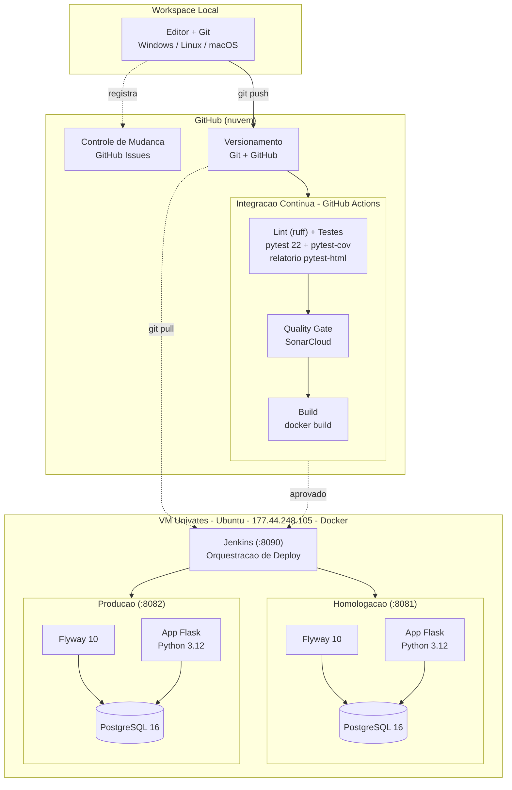

# Aurum Fintech


Aplicação web para controle de receitas e despesas, desenvolvida como projeto prático da disciplina **Gerência de Configuração de Software (4815207)** — Univates 2026/A.

---

## Arquitetura geral



---

## Stack de tecnologias

| Camada | Tecnologia |
|---|---|
| Linguagem | Python 3.12 |
| Framework web | Flask 3.1 |
| Banco de dados | PostgreSQL 16 |
| Versionamento do banco | Flyway 10 |
| Contêineres | Docker + Docker Compose |
| Sistema Operacional (VM) | Ubuntu (VM Univates) |
| Controle de mudança | GitHub Issues |
| Versionamento de código | Git + GitHub |
| Integração contínua | GitHub Actions |
| Testes automatizados | pytest + pytest-cov + pytest-html |
| Linter | ruff |
| Qualidade de código | SonarCloud |
| Orquestração de deploy | Jenkins |

---

## Pipeline CI/CD

O pipeline é disparado automaticamente a cada `push` ou `pull request` na branch `main`, definido em `.github/workflows/ci.yml`.

```
[push/PR] ──► test ──► build
```

**job `test`**
- Sobe um container PostgreSQL 16 como service do runner
- Aplica as migrations com Flyway via Docker
- Instala as dependências (`requirements.txt`)
- Roda o **lint com ruff** (`ruff check`)
- Executa os **22 testes** com `pytest`, gerando **cobertura** (`pytest-cov` → `coverage.xml`) e o **relatório HTML** (`pytest-html`), publicado como artifact
- Executa o **scan do SonarCloud** e aguarda o **Quality Gate**, **falhando o pipeline** se o gate reprovar

**job `build`** *(depende de `test`)*
- Constrói a imagem Docker da aplicação (`docker build`) para validar que o build está íntegro

> A análise de qualidade roda dentro do job `test`, depois dos testes, para que o `coverage.xml` esteja disponível ao SonarCloud no mesmo workspace.

---

## Fluxo de uma mudança

1. **Registrar** — abrir uma Issue no GitHub descrevendo a mudança
2. **Implementar** — código-fonte em `app.py`/`templates/` e, se necessário, nova migration em `migrations/`
3. **Versionar** — commit com referência à issue (`closes #N`) e push para o GitHub
4. **Integração automática** — GitHub Actions executa lint, testes, cobertura, qualidade (SonarCloud) e build
5. **Atualizar Homolog** — no Jenkins, job `Deploy Aurum` → `Build with Parameters` → `AMBIENTE = homolog`
6. **Validar em Homolog** — acessar `http://177.44.248.105:8081` e verificar a mudança + migrations aplicadas
7. **Atualizar Produção** — no Jenkins, job `Deploy Aurum` → `Build with Parameters` → `AMBIENTE = prod`
8. **Validar em Prod** — acessar `http://177.44.248.105:8082`

O Jenkins faz `git pull` do repositório e executa o script de deploy correspondente, que recria os containers e reaplica as migrations via Flyway. O processo é semi-automatizado: a única ação manual é o clique que dispara o job.

---

## Versionamento do banco de dados

As migrations ficam em `migrations/` seguindo o padrão Flyway (`V{n}__{descricao}.sql`). O Flyway é executado como container separado antes da aplicação subir, tanto no CI quanto nos ambientes de homolog e produção, e registra o histórico aplicado na tabela `flyway_schema_history`.

```
migrations/
├── V1__init.sql          # cria tabelas usuario e lancamento
├── V2__seed_inicial.sql  # único usuário admin (admin/admin123) — sem lançamentos seed
└── V3__add_observacao.sql# adiciona coluna observacao em lancamento
```

> ⚠ As senhas no banco são armazenadas com hash `pbkdf2:sha256` (`werkzeug.security`).

---

## Testes automatizados

São 22 testes cobrindo os principais fluxos da aplicação (admin padrão: `admin/admin123`):

| # | Teste |
|---|---|
| 1 | Login com credenciais corretas |
| 2 | Login com credenciais inválidas |
| 3 | Acesso sem autenticação redireciona para login |
| 4 | Logout encerra a sessão |
| 5 | Listagem de lançamentos acessível com login |
| 6 | Página de perfil carrega |
| 7 | Formulário de novo lançamento carrega |
| 8 | Criar lançamento do tipo receita |
| 9 | Criar lançamento do tipo despesa |
| 10 | Criar lançamento com observação e verificar persistência no banco |
| 11 | Criar lançamento com situação inativo |
| 12 | Criar lançamento sem descrição retorna erro de validação |
| 13 | Criar lançamento sem valor retorna erro de validação |
| 14 | Editar lançamento existente e verificar atualização no banco |
| 15 | Editar lançamento inexistente redireciona |
| 16 | Excluir lançamento e verificar remoção no banco |
| 17 | Filtro por tipo receita |
| 18 | Filtro por tipo despesa |
| 19 | Filtro por situação inativo (com registro garantido no banco) |
| 20 | Filtro por intervalo de datas (com registro de data conhecida) |
| 21 | Exportar PDF da listagem completa |
| 22 | Exportar PDF com filtro aplicado |

O relatório de execução é gerado em HTML pelo `pytest-html` e a cobertura pelo `pytest-cov`, ambos publicados/enviados no pipeline (cobertura vai para o SonarCloud).

Para rodar localmente (requer banco configurado):

```bash
pip install -r requirements.txt
pytest test_app.py -v --cov=app --cov-report=term --html=relatorio-testes.html --self-contained-html
```

---

## Qualidade de código

Duas camadas complementares:

- **ruff** — linter que roda no início do pipeline, verificando forma do código (imports/variáveis não usados, formatação). Configuração em `ruff.toml`.
- **SonarCloud** — análise estática integrada ao pipeline (após os testes), avaliando bugs, code smells, vulnerabilidades, duplicação e cobertura. O **Quality Gate** reprova o pipeline se o código novo não atender aos critérios. Configuração em `sonar-project.properties`. Painel: [SonarCloud](https://sonarcloud.io/summary/new_code?id=aurum-fintech).

---

## Ambientes

A VM hospeda o Jenkins e os ambientes em containers Docker. A infraestrutura é criada de forma automatizada.

### Criar a infraestrutura na VM (do zero)

```bash
scp setup-aurum-local.sh univates@177.44.248.105:~/
ssh univates@177.44.248.105
bash ~/setup-aurum-local.sh
```

O script instala o Docker, clona o projeto, gera o `.env` e sobe o **Jenkins** (`http://177.44.248.105:8090`). A partir daí, os ambientes são criados/atualizados pelo job `Deploy Aurum`.

### Atualizar (semi-automatizado, via Jenkins)

No Jenkins → job `Deploy Aurum` → `Build with Parameters`:
- `AMBIENTE = homolog` → atualiza `http://177.44.248.105:8081`
- `AMBIENTE = prod` → atualiza `http://177.44.248.105:8082`

Cada deploy reconstrói a imagem da aplicação e reaplica as migrations via Flyway.

### Alternativa manual (sem Jenkins)

```bash
docker compose -f docker-compose.homolog.yml up -d --build   # homolog
docker compose -f docker-compose.prod.yml    up -d --build   # produção
```

---

## Estrutura do projeto

```
aurum-fintech/
├── .github/workflows/ci.yml       # pipeline GitHub Actions (lint, testes, cobertura, Sonar, build)
├── jenkins/                       # configuração do Jenkins (admin + job de deploy)
├── migrations/                    # migrations Flyway
├── templates/                     # páginas HTML (Jinja2)
├── app.py                         # rotas e lógica da aplicação
├── test_app.py                    # 22 testes automatizados
├── Dockerfile                     # imagem da aplicação
├── Dockerfile.jenkins             # imagem customizada do Jenkins
├── docker-compose.homolog.yml     # ambiente de homologação
├── docker-compose.prod.yml        # ambiente de produção
├── docker-compose.jenkins.yml     # serviço do Jenkins
├── deploy-homolog.sh              # script de deploy homolog
├── deploy-prod.sh                 # script de deploy produção
├── setup-aurum-local.sh           # cria toda a infra na VM (demo)
├── ruff.toml                      # configuração do linter
├── sonar-project.properties       # configuração SonarCloud
└── requirements.txt               # dependências Python
```
